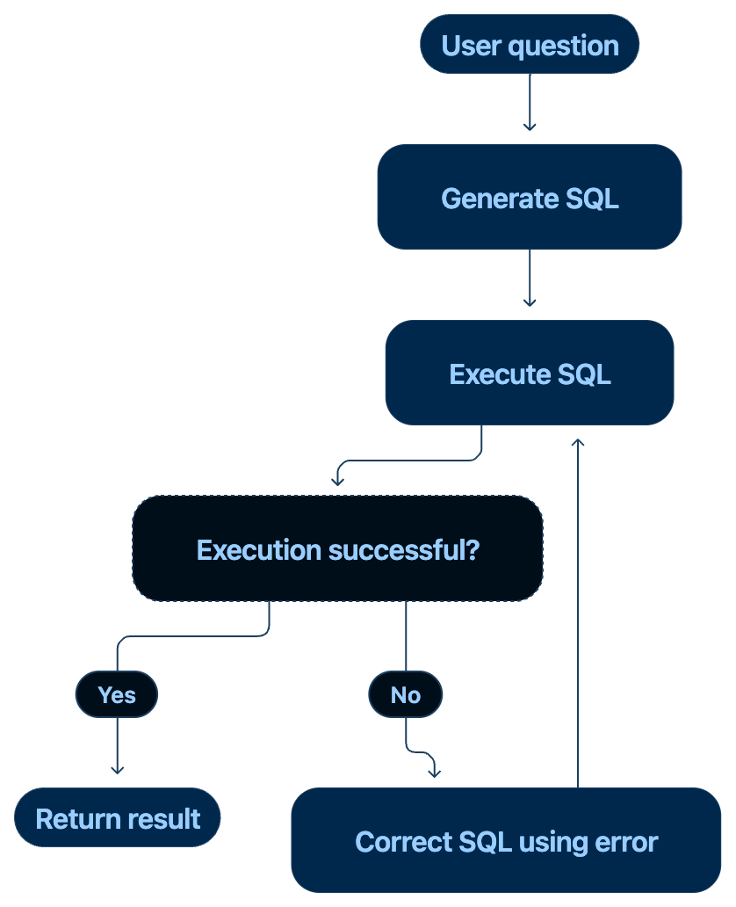
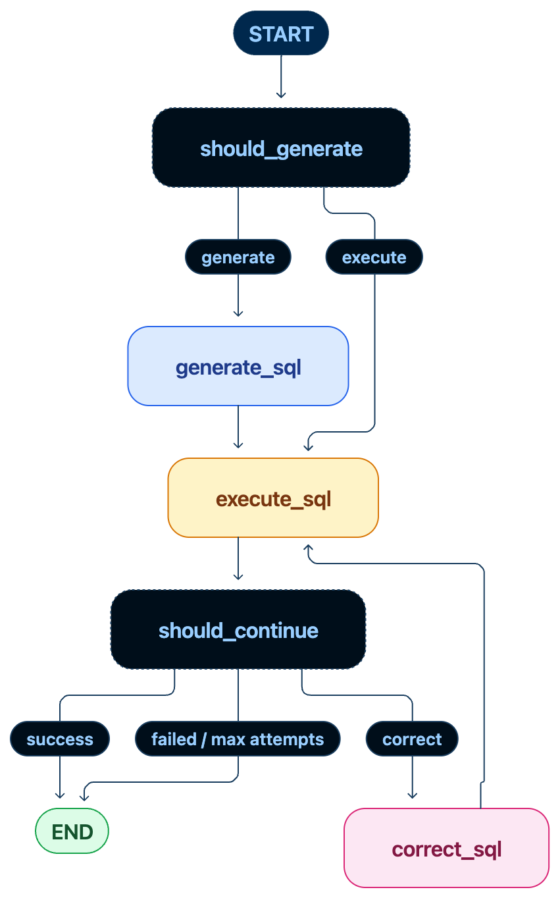

# Self-Healing SQL Agent

Self-Healing SQL Agent is an asynchronous AI agent that converts natural-language questions into SQL queries, executes them through an MCP database tool, detects execution failures, and uses the database error to generate a corrected query.

The project demonstrates an agent workflow where an LLM can observe a tool failure and recover from it rather than terminating after the first failed query.

## Objective

The objective is to build a small but complete AI agent system that demonstrates:

- LLM-based SQL generation
- LangGraph agent orchestration
- MCP-based tool access
- automatic error-driven SQL correction
- asynchronous job processing
- OpenTelemetry tracing
- automated testing

The main behaviour is:



## What it does

The agent accepts a natural-language question such as:

```text
Which employees earn more than 80000?
```

It can also receive an intentionally incorrect initial query:

```sql
SELECT name, department FROM employees
```

The database returns:

```text
no such column: department
```

The error is passed to Gemini together with the original question, database schema, and failed SQL.

Gemini generates:

```sql
SELECT name, salary FROM employees WHERE salary > 80000
```

The corrected query is then executed successfully.

The agent supports up to three correction attempts.

## System Architecture

```text
                         FastAPI
                            ↓
                         Redis
                            ↓
                         Arq
                            ↓
                       LangGraph
                            ↓
                          Gemini
                            ↓
                        MCP Client
                            ↓
                       MCP Server
                            ↓
                         SQLite
```

The MCP server exposes database operations as tools:

```text
MCP Server
├── get_database_schema
└── execute_sql
```

The agent does not directly access the SQLite implementation during its tool execution. Database operations are exposed through the MCP interface.

## Self-Healing Agent

The LangGraph StateGraph contains three main stages:



The agent state tracks:

```text
AgentState
├── question
├── schema
├── sql
├── result
├── error
├── stacktrace
└── attempts
```

The correction step receives:

- the original question
- database schema
- failed SQL
- database error

This allows the LLM to correct the query based on the actual execution failure rather than simply generating another query from scratch.

## MCP

The database is exposed through an MCP server.

```text
LangGraph Agent
      ↓
  MCP Client
      ↓
  MCP Protocol
      ↓
  MCP Server
      ↓
   SQLite
```

The MCP server exposes:

```text
get_database_schema()
execute_sql(sql)
```

This separates the agent's reasoning from the database implementation and provides a controlled tool interface between the agent and the database.

## Observability

The project uses OpenTelemetry and Jaeger to trace the agent execution.

A typical successful self-healing trace is:

```text
agent.run
├── MCP → get_database_schema
├── sql.execute ❌
│     ├── SQL
│     ├── database error
│     └── stacktrace
├── llm.correct_sql
│     ├── failed SQL
│     ├── database error
│     └── corrected SQL
└── sql.execute ✅
      └── corrected SQL
```

The trace records information including:

- user question
- generated SQL
- failed SQL
- database error
- exception stacktrace
- corrected SQL
- SQL execution success
- number of correction attempts
- Gemini model used
- MCP tool calls

Jaeger can be accessed locally at:

```text
http://localhost:16686
```

OpenTelemetry is used for **observability of the agent execution**, rather than as an explainability method.

## Qualitative Assessment

The project was evaluated by observing whether the agent could recover from realistic SQL execution errors.

The primary test case intentionally provides:

```sql
SELECT name, department FROM employees
```

The `employees` table does not contain a `department` column.

The agent receives:

```text
no such column: department
```

and successfully produces:

```sql
SELECT name, salary FROM employees WHERE salary > 80000
```

The final execution returns the expected employees.

The resulting trace confirms the complete recovery path:

```text
Failed SQL
    ↓
Database Error
    ↓
LLM Correction
    ↓
Corrected SQL
    ↓
Successful Execution
```

This demonstrates functional self-healing for SQL execution errors.

## Tech Stack

| Technology | Purpose |
|---|---|
| Python | Application and agent implementation |
| Gemini 2.5 Flash | SQL generation and correction |
| LangChain | LLM integration |
| LangGraph | Agent workflow orchestration |
| MCP | Database tool interface |
| SQLite | Database |
| FastAPI | Asynchronous API |
| Redis | Job queue |
| Arq | Asynchronous worker processing |
| OpenTelemetry | Distributed tracing |
| Jaeger | Trace visualisation |
| Pydantic | API request validation |
| Docker Compose | Redis and Jaeger infrastructure |
| Pytest | Automated testing |

## Project Structure

```text
self-healing-sql-agent/
│
├── app/
│   ├── agent.py
│   ├── database.py
│   ├── graph.py
│   ├── init_db.py
│   ├── main.py
│   ├── mcp_client.py
│   ├── mcp_server.py
│   ├── prompts.py
│   ├── telemetry.py
│   ├── test_mcp_client.py
│   └── worker.py
│
├── data/
│   └── company.db
│
├── tests/
│   ├── test_agent.py
│   ├── test_database.py
│   └── test_sql_tool.py
│
├── .env
├── docker-compose.yml
├── pytest.ini
├── requirements.txt
└── README.md
```

## Database

The project uses a small SQLite database containing:

```text
departments
├── id
└── name

employees
├── id
├── name
├── department_id
└── salary

projects
├── id
├── name
├── department_id
└── budget
```

The database can be recreated using:

```bash
python -m app.init_db
```

## Testing

Run the complete test suite:

```bash
pytest
```

The tests cover:

- database schema retrieval
- direct database query execution
- successful MCP SQL execution
- SQL execution errors
- malformed SQL
- self-healing agent execution

Expected result:

```text
6 passed
```

### MCP Client Test

The MCP client can also be tested independently:

```bash
python -m app.test_mcp_client
```

This verifies communication between:

```text
MCP Client
    ↓
MCP Server
    ↓
SQLite
```

## Local Setup

### 1. Install dependencies

Create and activate a Python environment, then run:

```bash
pip install -r requirements.txt
```

### 2. Configure Gemini

Create a `.env` file:

```text
GOOGLE_API_KEY=your_api_key
```

Do not commit `.env` to the repository.

### 3. Initialise the database

```bash
python -m app.init_db
```

### 4. Start Redis and Jaeger

```bash
docker compose up -d
```

Check the containers:

```bash
docker compose ps
```

Stop them with:

```bash
docker compose down
```

### 5. Start the Arq worker

In a separate terminal:

```bash
python -m arq app.worker.WorkerSettings
```

### 6. Start FastAPI

In another terminal:

```bash
uvicorn app.main:app --reload
```

The API will be available at:

```text
http://127.0.0.1:8000
```

## Running the Agent

Submit a job with an intentionally incorrect SQL query:

```bash
curl -X POST http://127.0.0.1:8000/jobs \
  -H "Content-Type: application/json" \
  -d '{
    "question": "Which employees earn more than 80000?",
    "initial_sql": "SELECT name, department FROM employees"
  }'
```

The API returns:

```json
{
  "job_id": "xxxxxxxxxxxxxxxx",
  "status": "queued"
}
```

Use the returned job ID to check the result:

```bash
curl http://127.0.0.1:8000/jobs/<JOB_ID>
```

A successful result contains the corrected SQL and query results.

## Observing a Run

With Jaeger running, open:

```text
http://localhost:16686
```

Select the service:

```text
self-healing-sql-agent
```

A self-healing execution should show:

```text
agent.run
    ↓
sql.execute ❌
    ↓
llm.correct_sql
    ↓
sql.execute ✅
```

MCP operations such as:

```text
MCP send tools/call execute_sql
MCP send tools/call get_database_schema
```

are also visible in the trace.

## API

### Submit Job

```http
POST /jobs
```

Request:

```json
{
  "question": "Which employees earn more than 80000?",
  "initial_sql": "SELECT name, department FROM employees"
}
```

Response:

```json
{
  "job_id": "xxxxxxxxxxxxxxxx",
  "status": "queued"
}
```

### Get Job Result

```http
GET /jobs/{job_id}
```

Returns the current job status and, when completed, the agent result.

## Project Evolution

### Phase 01 — SQL Agent

Implemented:

- SQLite database
- natural-language SQL generation
- LangChain Gemini integration
- LangGraph workflow
- SQL execution
- automatic SQL correction
- correction attempt limit
- automated tests

### Phase 02 — Asynchronous Processing

Implemented:

- FastAPI API
- Redis
- Arq worker
- asynchronous job submission
- job status and result retrieval

The API can return `202 Accepted` while the agent continues processing in the background.

### Phase 03 — MCP Integration

Implemented:

- MCP server
- MCP database tools
- MCP client
- schema retrieval through MCP
- SQL execution through MCP
- MCP error propagation
- MCP client tests

The database interaction was separated from the agent through an MCP tool interface.

### Phase 04 — Observability

Implemented:

- OpenTelemetry tracing
- Jaeger integration
- agent execution spans
- LLM correction spans
- SQL execution spans
- exception and stacktrace recording
- MCP operation tracing

## Current Limitations

- The database is currently SQLite and intended for local demonstration.
- SQL execution is not yet restricted to read-only operations.
- The MCP client currently creates a new MCP session for individual operations.
- The agent relies on the LLM to generate syntactically and semantically appropriate SQL.
- There is no persistent conversation or query history.
- The evaluation currently focuses on functional recovery rather than a large benchmark.
- The current API exposes a small job-based interface rather than a production authentication layer.

## Next Steps

Potential improvements include:

- long-lived MCP client sessions
- database permission and SQL safety policies
- PostgreSQL and `pgvector` integration
- schema retrieval through a vector/RAG layer
- larger SQL error evaluation dataset
- structured agent outputs
- query execution timeouts
- query result limits
- authentication and API security
- persistent execution history
- agent performance metrics
- richer evaluation of self-healing accuracy
- deployment using separate API and worker services